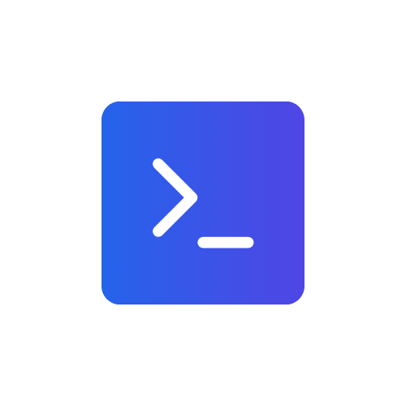

# 10xCoder Frontend

Welcome to the 10xCoder frontend repository! This project aims to provide a modern, intuitive interface for the 10xCoder platform. We appreciate your interest in contributing to our open source project.


## 🚀 Getting Started

### Prerequisites

- Node.js (v18.0.0 or higher)
- pnpm (v8.0.0 or higher)
- TypeScript knowledge (project is built with TypeScript)

### Installation

1. Fork the repository
2. Clone your forked repository
   ```bash
   git clone https://github.com/YOUR-USERNAME/10xcoder-frontend.git
   ```
3. Navigate to the project directory
   ```bash
   cd 10xcoder-frontend
   ```
4. Install dependencies
   ```bash
   pnpm install
   ```
5. Set up environment variables
   ```bash
   cp .env.example .env.local
   ```
   Then update the values in `.env` as needed
   
6. Start the development server
   ```bash
   pnpm dev
   ```
6. Open [http://localhost:3000](http://localhost:3000) in your browser

## 🏗️ Tech Stack

- [Next.js](https://nextjs.org/) - React framework for building server-side rendered and static web applications
- [TypeScript](https://www.typescriptlang.org/) - Strongly typed programming language that builds on JavaScript
- [Tailwind CSS](https://tailwindcss.com/) - Utility-first CSS framework
- [ShadcnUI](https://ui.shadcn.com/) - Beautifully designed components built with Radix UI and Tailwind CSS
- [React Query](https://tanstack.com/query/latest) - Data fetching and state management library

## 🔐 Environment Variables

This project uses environment variables for configuration. We've provided a `.env.example` file that lists all the required environment variables with placeholder values.

To set up your environment:

1. Copy the example file to create your local environment file
   ```bash
   cp .env.example .env
   ```

2. Edit `.env` to add your actual values

**Important:** Never commit your `.env` file or any other files containing actual environment values. They are listed in `.gitignore` for a reason.

## 📁 Project Structure

This project uses environment variables for configuration. We've provided a `.env.example` file that lists all the required environment variables with placeholder values.

To set up your environment:

1. Copy the example file to create your local environment file
   ```bash
   cp .env.example .env
   ```

2. Edit `.env` to add your actual values

**Important:** Never commit your `.env` file or any other files containing actual environment values. They are listed in `.gitignore` for a reason.

```
10xcoder-frontend/
├── app/                  # Next.js app directory
├── components/           # Reusable UI components
├── hooks/                # Custom React hooks
├── lib/                  # Utility functions and shared logic
├── public/               # Static assets
└── ...
```

## 👥 Contributing Guidelines

We welcome contributions from everyone! Here's how you can help:

### 1. Find or Create an Issue

Before working on anything, check if an issue already exists. If not, create one to discuss the changes you'd like to make.

**Important Note:** This repository is for frontend-related issues only. Please do not create issues related to backend functionality here. Frontend issues include UI components, styling, client-side functionality, and frontend performance optimizations.

### 2. Issue Assignment

1. Find an issue you'd like to work on
2. Comment on the issue expressing your interest
3. Wait for a maintainer to assign the issue to you
4. **Only begin working on the issue after it has been officially assigned to you**

This helps prevent multiple people from working on the same issue simultaneously.

### 3. Branch Naming Convention

Create a branch with a descriptive name following this pattern:
```
<type>/<short-description>
```

Types include:
- `feature`: New functionality
- `bugfix`: Bug fixes
- `docs`: Documentation changes
- `refactor`: Code refactoring
- `test`: Adding or improving tests
- `chore`: Maintenance tasks

Example: `feature/user-authentication`

### 4. Commit Message Guidelines

We follow a structured commit message format to maintain a clean git history. Each commit message should be structured as:

```
<type>(<scope>): <subject>
```

#### Types:
- `feat`: A new feature
- `fix`: A bug fix
- `docs`: Documentation changes
- `style`: Code style changes (formatting, missing semi-colons, etc)
- `refactor`: Code refactoring
- `test`: Adding tests
- `chore`: Changes to the build process or auxiliary tools
- `perf`: Performance improvements

#### Example Commit Messages:
- `feat(auth): implement user login flow`
- `fix(ui): correct button alignment in sidebar`
- `docs(readme): update installation instructions`

### 5. Detailed Contribution Workflow

#### Fork and Clone the Repository
1. Click the "Fork" button at the top right corner of the repository page
2. Clone your forked repository to your local machine
   ```bash
   git clone https://github.com/YOUR-USERNAME/10xcoder-frontend.git
   ```
3. Navigate to the project directory
   ```bash
   cd 10xcoder-frontend
   ```
4. Add the original repository as upstream
   ```bash
   git remote add upstream https://github.com/techysiddhant/10xcoder-frontend.git
   ```

#### Keep Your Fork Updated
1. Fetch changes from the upstream repository
   ```bash
   git fetch upstream
   ```
2. Switch to your main branch
   ```bash
   git checkout main
   ```
3. Merge changes from upstream to your local main branch
   ```bash
   git merge upstream/main
   ```
4. Push the updated main branch to your fork
   ```bash
   git push origin main
   ```

#### Create a Feature Branch
1. Create a new branch with a descriptive name following our naming convention
   ```bash
   git checkout -b feature/your-feature-name
   ```

#### Make Changes and Commit
1. Make your changes to the codebase
2. Stage your changes
   ```bash
   git add .
   ```
3. Commit your changes following our commit message guidelines
   ```bash
   git commit -m "feat(component): add new button variant"
   ```
4. Push your branch to your fork
   ```bash
   git push origin feature/your-feature-name
   ```

#### Submit a Pull Request
1. Go to the original repository on GitHub
2. Click "Pull Request" button
3. Select your feature branch and provide a detailed description
4. Submit the pull request for review

### 6. Pull Request Template

When creating a PR, please provide:
- A clear, descriptive title
- A detailed description of the changes
- References to related issues
- Screenshots or GIFs for UI changes (if applicable)

### 7. Code Review Process

- All PRs require at least one review from a maintainer
- Address any requested changes promptly
- Once approved, a maintainer will merge your PR

### 8. Code Style

- We use ESLint and Prettier for code formatting
- Run `pnpm lint` before submitting your PR
- Follow the existing code style patterns

## 🚀 Deployment

Our deployment process is automated through CI/CD. When your PR is merged to main, it will be automatically deployed to the staging environment.

## 📜 License

This project is licensed under the MIT License - see the [LICENSE](LICENSE) file for details.

## 🙏 Acknowledgements

- Thanks to all contributors who have helped make this project better
- Special thanks to the open-source community for providing the tools and libraries we use

---

Happy coding! 🚀

For questions, feel free to reach out to the maintainers or open an issue.